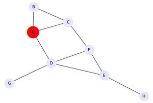
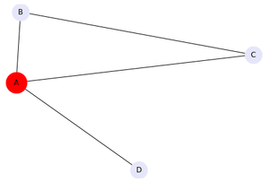

# Ego_Network
#### Ego graph Using Networkx in Python

Ego network is a special type of network consisting of one central node and all other nodes directly connected to it. The central node is known as ego, while the other surrounding nodes directly connected to it are known as alters. Ego networks are mostly used in analyzing social connections, links, and relationships. The network shown below is an illustration of Ego Network. The central node (ego) is shown as circular surrounded by the neighboring nodes (alters). 
 
Ego network is widely used in Social network analysis. The basic hypothesis about ego networks is that strong ties are homophilous. Homophilous is the tendency of individuals who are socially connected in some way to display certain traits or similarities to each other. In simple words, like-minded people are connected strongly in some manner. The ego network helps us to identify these hidden connections. 

The following functions are served by Ego Networks: 

* Propagation of information efficiently. 
* Sensemaking from links, For example – Social links, relationships. 
* Access to resources, efficient connection path generation. 
* Community detection, identification of the formation of groups. 
* Analysis of the ties among individuals for social support. 

##### Creating a sample network

We are taking a sample network with few nodes interconnected to each other. In this example, the nodes are – (A, B, C, D, E, F, G, H), out of these nodes one node is taken as the central node (ego), in our case we have taken A as the ego.  

 
Parent graph: 
 

 
 
Ego graph: 
 

For more info visit [here](https://www.geeksforgeeks.org/ego-graph-using-networkx-in-python/)
